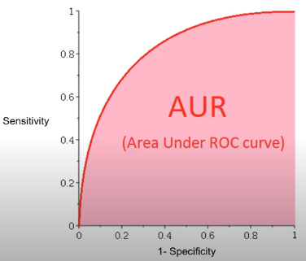

# Machine Learning Engineer Nanodegree
## Capstone Proposal
Pawel Wisniewicz  
05-06-2020

## Proposal

### Domain Background

Nowaday by paying by card, by online shopping, by using our smartphones, by surfing the internet we are leaving a digital footprint.
More and more data is collected, due to that there are a new possibilities for businesses to explore that data and find some insights 
which can boost their effectivness. Marketing is one of the fastest growing fields utilizing big data opportunities.

### Problem Statement

The main challange is to improve the selection of people for targets of a marketing campaign.

### Dataset and Inputs

This dataset in a real life customer's data delivered by Alvato Financial Solutions. They provide 4 datasets:
- Demographics information about general population in Germany. 891,211 samples with 366 features.
- Demographics informations about customers of the sales company in Germany. 191,652 samples with 369 features.
- Demographics informations about people targeted with the campaign. 42,982 samples with 367 features.
- Demographics informations about people targeted with the campaign. 42,833 samples with 366 features.

The general population dataset includes different informations such as: age, gender, personal profile, purchase information, 
state of possesion and many other features provided for all individuals.    
In the customers dataset there are exactly the same features plus 3 additional 'CUSTOMERS_GROUP', PRODUCT_GROUP' and 'ONLINE_PURCHASE'.
These extra columns provide more precise information about each individual's customer profile.  
Third dataset contains informations about targeted people along with additional column 'RESPONSE' indicating whether each person was
attracted by the compaign or not. Remaining features are exactly the same.  
The last dataset includes test data, the same columns like in the third dataset except missing 'RESPONSE' column, for this portion of data we need to predict how likly each person is to become a new customer.  

There are also two excel files:
- List of attributes and descriptions segmenting them by the type of attribute e.g. Person, Hausehold etc.
- Detailed list of attributes with thier values described.

### Solution Statement

Utilizing avaliable data about each person will help to identify prospect customers more efficiently, reducing number of failure.

### Benchmark Model

The best model will be selected based on the k-fold cross-validation results. This way data is trained and tested on verious observations so the best model has to perform good enough on all test sets to reduce bias.

  

### Evaluation Metrics

Model performance is measured using AUC which results in ratio between True possitive and False possitive rates. The data is unbalanced becasue there is much more individuals who were targeted and did not respond. 

  

### Project Design

First I will start with data exploration, I will use lists of attributes to understand demographics informations. Then I will analyse each column to explore the scale of measurments whether this is a nominal, ordinal or numeric( interval, ratio) scale. It is also worth to check how much missing values are there.  

Then using unsupervised machine learnign techniques I will perform clustering on general population dataset before that I need to use verious techniques for dimensionality reductions such as PCA. After segmentation I will select the most important features which can help to determine which individuals of the general population are more likely to become a new customer.  

Then I will apply supervised machine learning techniques to find the best model which will be used to predict the probability of becoming a new customer for each individual in the test dataset.  
Prior to selecting the best model I will perform features engineering to reduce a noise. Then checking the correlation between features and using recursive feature elimination I will select the most important features to input into models. To much features may lead to the model being less accurate, particularly on unseen data. This is beacuse the model can be overfitted. Next I will perform k-fold cross-validation to select the best performing model. Then using grid search I will train a number of models across different hyperparameters and select the model with the highest AUC.
